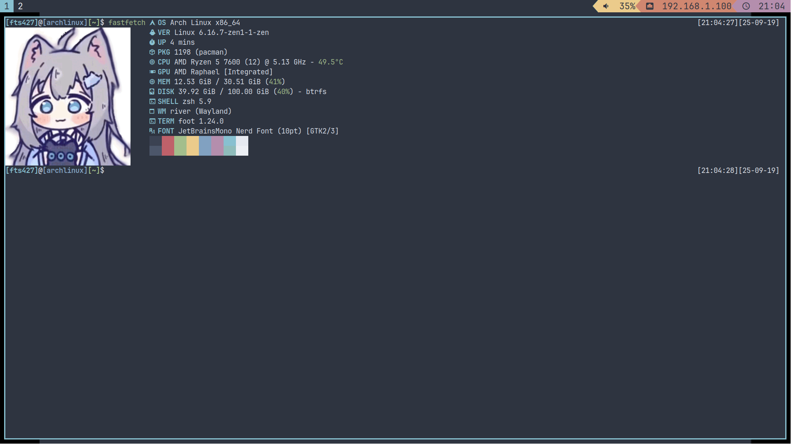

# My Dotfiles

## Env

Suitable for archlinux

## Config

DE: Hyprland

Terminal: foot

Bar: i3bar-river with i3status-rust

Show system info: fastfetch, htop

Editor: vim (plugin with [vim-plug](https://github.com/junegunn/vim-plug))

Shell: zsh

Media: mpv, mpd, rmpc

Download manager: aria2

And config files for: mako, cava, zellij, wpaperd and so on

Theme: Nord, Material

